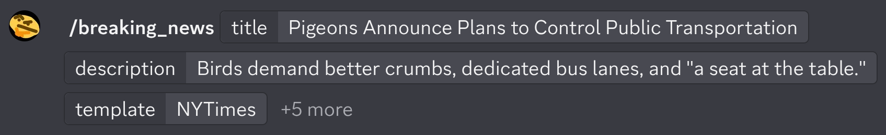
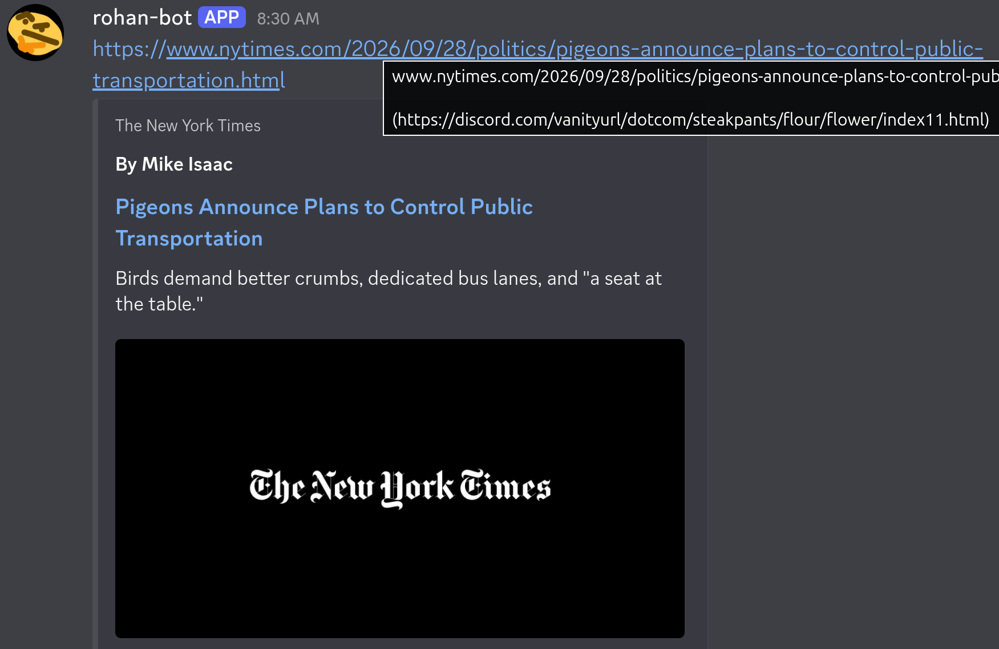

# rohan-bot
discord bot. does a bunch of stuff.

here's a rundown of the cogs:
* `dungewar`:
    * fetch oil price and daily quote from Dungewar API, output with formatting
    * call GNU units (very awesome tool) with sanitized input
* `gifs`: send a gif/sticker from the ever-expanding list
* `link_previews`:
    * creates a custom link preview by crafting a url to a [separate backend](https://github.com/TheGrapeApe22/breaking-news) and embedding it as any text. used to form prank articles. the direct url is fixed as [discord's vanity url](https://discord.com/vanityurl/dotcom/steakpants/flour/flower/index11.html) (rickroll without discord's confirmation message!!!), making it not abusable for malicious purposes.
    * demo:
    
    
    * rickroll command creates the preview profile based on a real webpage by extracting the content with playwright (`chromium_session.py`).
* `logging`: allows any message to be stored in a file with /log or .log, with timestamps+source, and viewable by day.
* `mao` (fun stuff):
    * give_card/leaderboard: give cards to users as a penalty. track it with the leaderboard.
    * soliloquy: generate a meme message by inserting nouns madlibs-style into memes and copypastas. randomizer enhanced with 7bag.
    * translate a message to a programming language! includes sanitization
    * guoggins pretrained transformer: archive and regurgitate quotes from the amazing guoggins. uses sqlite3.
* `reminders`: for servers, send a custom message periodically, for reminding you to lock in.